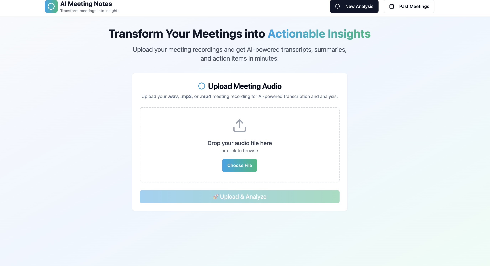
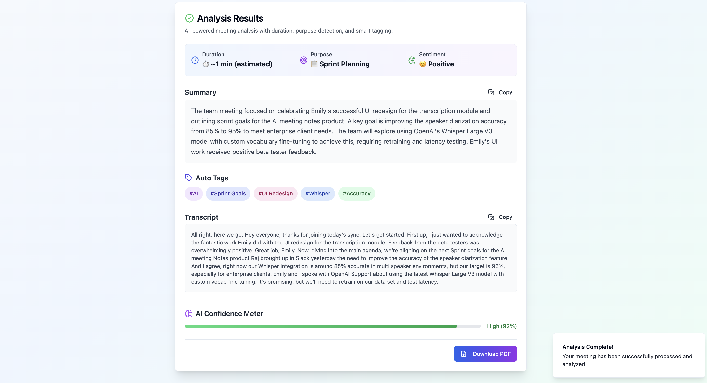

# AI Meeting Notes Dashboard

Transform your meeting recordings into actionable insights with **AI-powered transcription, summarization, sentiment analysis, and more**. This project includes a robust **backend** (Python, Flask, Gemini AI, MongoDB) and a beautiful, interactive **frontend** (React + TypeScript).

---

## ✨ Features

- **Audio Upload (WAV, MP3, MP4):** Upload meeting recordings of any common audio/video format.
- **Automatic Transcription:** Transcribes long audio files (up to 45+ minutes) reliably.
- **Gemini AI Analysis:**
  - **Executive Summary:** Brief, human-like summaries of your meetings.
  - **Sentiment Analysis:** Instantly gauges overall meeting tone (Positive/Neutral/Negative).
  - **AI Confidence Meter:** Shows the system’s estimated confidence in the results.
  - **Timestamps** (if supported): Shows time references for key transcript points.
- **Beautiful Dashboard UI:** Modern, responsive frontend with clear results and copy/download buttons.
- **PDF Download:** One-click export of meeting analysis.
- **MongoDB Atlas Integration:** Every meeting’s data is securely stored and retrievable.
- **Extensible:** Add new features or AI-powered analysis easily.

---

## 📸 Screenshots

### **1. Upload & Analyze UI**


### **2. Results Display**


---

## 🏗️ Project Structure

```

/frontend      # React + TypeScript dashboard (UI)
/backend       # Flask, Python, Gemini, MongoDB (API, processing)

````

---

## 🚀 Quick Start

### **1. Clone the Repository**

```bash
git clone https://github.com/your-username/your-repo-name.git
cd your-repo-name
````

### **2. Setup Backend**

```bash
cd backend
python3 -m venv venv
source venv/bin/activate  # Or .\venv\Scripts\activate on Windows
pip install -r requirements.txt
```

* Configure `config.py` with your Gemini API key and MongoDB URI (not tracked in Git).

```python
# config.py (do NOT commit to public repo)
GEMINI_API_KEY = "your-gemini-api-key"
MONGO_URI = "your-mongodb-uri"
```

* **Start the backend:**

```bash
python3 app.py
```

### **3. Setup Frontend**

```bash
cd ../frontend
npm install
npm run dev
```

### **4. Access the App**

* Open your browser to:
  `http://localhost:5173` (or your local Vite/React dev server)

---

## 🔒 Security & Best Practices

* Do NOT commit your `config.py` or any API keys to GitHub.
* Use `.gitignore` to keep out `venv`, `node_modules`, build artifacts, and all config/secret files.

---

## 📝 Example Workflow

1. **Upload** your `.wav`, `.mp3`, or `.mp4` meeting audio.
2. **Wait** as the backend transcribes and analyzes your file using Gemini AI.
3. **Review** your results: summary, sentiment, AI confidence, and more.
4. **Download PDF** or **copy text** with a click.
5. **All meeting data** is auto-saved to MongoDB for future retrieval.

---

## 💡 Tech Stack

* **Frontend:** React, TypeScript, Tailwind CSS, shadcn/ui, Lucide icons
* **Backend:** Python, Flask, Gemini AI, MongoDB Atlas
* **AI:** Google Gemini 1.5 (or OpenAI/Gemini/AssemblyAI as configured)
* **Database:** MongoDB Atlas (cloud-hosted)
* **PDF Export:** jsPDF

---

## 🛡️ License

MIT License.
(C) 2025 [Debashrestha Nandi](https://www.linkedin.com/in/debashrestha-nandi-a789a1340/)

---

## 🤝 Contact

For questions, feedback, or collaboration:

* Email: [deb86011@gmail.com](mailto:deb86011@gmail.com)
* LinkedIn: [Debashrestha Nandi](https://www.linkedin.com/in/debashrestha-nandi-a789a1340/)

